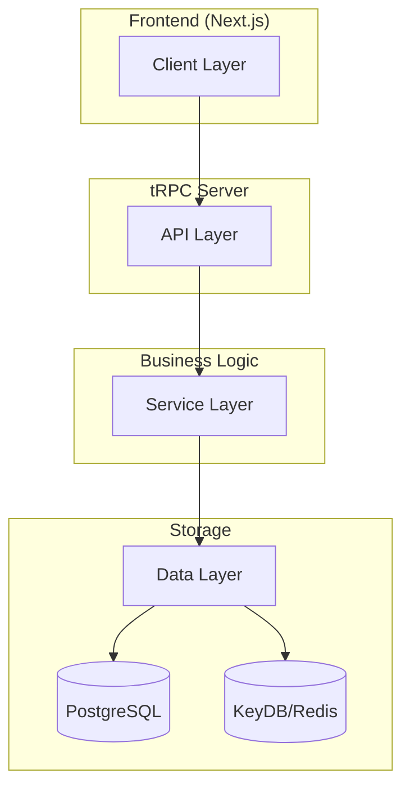

# Modern Full-Stack Monorepo Template

<div align="center">

[](https://www.typescriptlang.org/)
[](https://nextjs.org/)
[](https://trpc.io/)
[](https://tailwindcss.com/)
[](https://bun.sh/)
[](https://docs.keydb.dev/)
[](https://drizzle.dev/)
[](https://turbo.build/)

A high-performance, type-safe monorepo template engineered for building scalable web applications with modern best practices.

</div>

## 🏗 Architecture Overview

Our architecture follows a modern, scalable approach with clear separation of concerns:



## 🚀 Tech Stack

### Frontend (apps/web)

-  Server-side rendering & static generation
-  Modern React with Server Components
-  High-quality, accessible components
-  Utility-first styling
-  Seamless dark/light theming

### Backend (apps/server)

-  High-performance JavaScript runtime
-  End-to-end type-safe API layer
-  Type-safe database operations
-  High-performance Redis-compatible store

### Database (packages/database)

-  Primary database
-  Automated schema migrations
-  Real-time subscriptions

### Development & DevOps

-  Optimized build system
-  Full-stack type safety
-  Code quality
-  Code formatting
-  Containerization

## 📦 Project Structure

```bash
.
├── apps/
│   ├── web/                 # Next.js frontend application
│   │   ├── src/
│   │   │   ├── app/        # App router pages
│   │   │   ├── components/ # Reusable UI components
│   │   │   └── trpc/      # tRPC client configuration
│   │   └── public/         # Static assets
│   │
│   └── server/             # Backend application
│       ├── src/
│       │   ├── routers/    # tRPC route handlers
│       │   ├── services/   # Business logic layer
│       │   └── utils/      # Helper functions
│       └── tests/          # Backend tests
│
└── packages/
    └── database/           # Shared database package
        ├── migrations/     # Database migrations
        └── src/
            ├── schema.ts   # Database schema
            └── index.ts    # Database client
```

## ✨ Key Features

- **Type Safety**: End-to-end type safety with TypeScript and tRPC
- **High Performance**: Optimized build system with Turborepo
- **Modern UI**: Responsive design with shadcn/ui and Tailwind CSS
- **Real-time**: WebSocket support via KeyDB pub/sub
- **Developer Experience**: Hot reload, type checking, and linting
- **Scalability**: Modular architecture for easy scaling
- **Security**: Built-in security best practices
- **Testing**: Ready-to-use testing setup

## 🚦 Getting Started

1. **Prerequisites**

   ```bash
   bun --version # >= 1.1.15
   node --version # >= 18.0.0
   ```

2. **Installation**

   ```bash
   # Clone the repository
   git clone https://github.com/DKeken/trpc-monorepo-stack.git

   # Install dependencies
   pnpm install
   ```

3. **Environment Setup**

   ```bash
   # Copy environment files
   cp apps/web/.env.example apps/web/.env
   cp apps/server/.env.example apps/server/.env
   cp packages/database/.env.example packages/database/.env
   ```

4. **Development**
   ```bash
   # Start development servers
   pnpm dev
   ```

## 🤝 Contributing

We welcome contributions! Please see our [Contributing Guide](CONTRIBUTING.md) for details.

## 📄 License

This project is licensed under the MIT License - see the [LICENSE](LICENSE) file for details.
